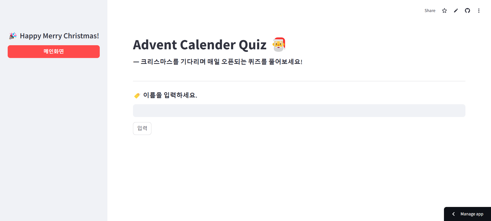
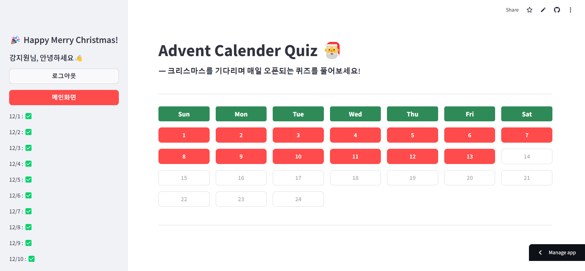

# README

> Webapp that allows users to solve daily quizzes in the concept of an Advent Calendar leading up to Christmas!  
  
- language : `python`
- library : `streamlit`, `pandas`
- database : `sqlite3`

🎅 **HAPPY MERRY CHRISTMAS !**

---

> First Page
  

  
> Calendar Page
  
